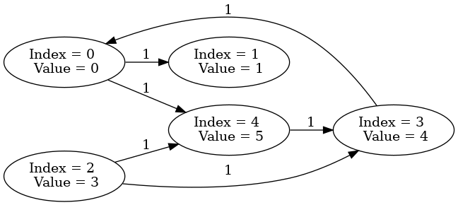

# Project Name
> Build a data structures that handles big graphs
> Live demo [_here_](https://www.example.com). <!-- If you have the project hosted somewhere, include the link here. -->

## Table of Contents
- [Project Name](#project-name)
  - [Table of Contents](#table-of-contents)
  - [General Information](#general-information)
  - [Technologies Used](#technologies-used)
  - [Features](#features)
  - [Screenshots](#screenshots)
  - [Setup](#setup)
  - [Usage](#usage)
  - [Project Status](#project-status)
  - [Contact](#contact)
<!-- * [License](#license) -->

## General Information
- This is the homework from one of my courses from the university.
- The project provides a way to manage graphs using sprase matrix representations (CSR).
<!-- You don't have to answer all the questions - just the ones relevant to your project. -->

## Technologies Used
- python - version 3.8
- numpy - version 1.22.3
- mathplotlib - version 3.5.1
- graphviz - version 0.20.1

## Features
List the ready features here:
- create graph from file
- visualize graph
- get induced subgraph based on node index
- get induced subgraph using BFS, DFS
- List node/ edge order from BFS, DFS algorithms.

## Screenshots

<!-- If you have screenshots you'd like to share, include them here. -->

## Setup
To run and use it:
- I have not package it, so it is basically a python file, so you can download it and paste it into your project.
- run pip install -r requirements.txt
- install graphviz from link: https://www.graphviz.org/download/

To run a demo via docker:
-  docker build -t my_graph_lib .
-  docker run --rm -it --env="DISPLAY" --env="QT_X11_NO_MITSHM=1"  --workdir=/app -v="$PWD":/app --volume="/etc/group:/etc/group:ro"  --volume="/etc/passwd:/etc/passwd:ro" --volume="/etc/shadow:/etc/shadow:ro" --volume="/etc/sudoers.d:/etc/sudoers.d:ro" --volume="/tmp/.X11-unix:/tmp/.X11-unix:rw"  my_graph_lib python3 demo.py

## Usage
See demo.py for basic use cases.

## Project Status
Project is: _in progress_, this is just a small projects from course work, i will comback to it if i have time.

## Contact
[@uytran201199](uytran20111999@gmail.com) - feel free to contact me!

<!-- Optional -->
<!-- ## License -->
<!-- This project is open source and available under the [... License](). -->

<!-- You don't have to include all sections - just the one's relevant to your project -->